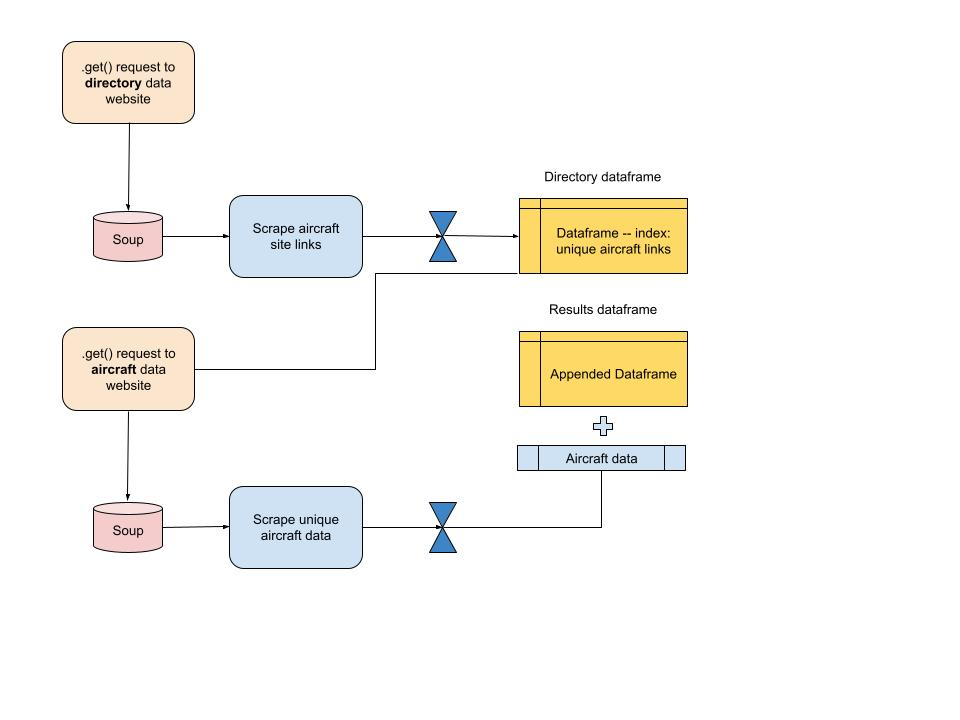

# evtol_scraper
Webscraping tools for extracting eVTOL aircraft OEM data from two websites.

## Table of Contents

1. [About](#about)
2. [Use Cases](#use_cases)
3. [Installation](#installation)
5. [File Descriptions](#files)
7. [Licensing, Authors, and Acknowledgements](#licensing)
8. [View the notebooks](#notebooks)

## About 

This repository contains tools for scraping eVTOL aircraft data from two websites:

1. https://evtol.news/
2. https://transportup.com/

Each set of scraper functions, contained in individual packages, follows an identical process architecture show below.

## Use Cases 

Source data for:

* Market sizing and GTM research
* Competitive intelligence
* Financial models -- forecasting within eVTOL / UAM space

## Installation 

* [BeautifulSoup](https://www.crummy.com/software/BeautifulSoup/bs4/doc/) 
* Standard libraries across Python 3* Anaconda distribution.

## File Descriptions 

* Jupyter Notebook for analysis: evtol_overview.ipynb
* Python files for custom functions

    * transportup_funcs.py
    * evtolnews_scrapefuncs.py

* .csv files for read and writing to directory and results dataframes

    * tu_directory_{date}.csv --> dataframe of aircraft links (to scrape)
    * tu_results_df_{date}.csv --> dataframe of scraped and cleaned aircraft data
    
    * evtolnews_directory_{date}.csv --> dataframe of aircraft links (to scrape)
    * evtolnews_results_df_{date}.csv --> dataframe of scraped and cleaned aircraft data

## Licensing, Authors, Acknowledgements

All code is open for any and all usage.

## View the notebooks 

View the evtol.news scraper at Jupyter's NBviewer site, [click here.](https://nbviewer.jupyter.org/github/rovertm/faa_repair_stations/blob/master/faarepair_stations.ipynb)

View the TransportUP scraper at Jupyter's NBviewer site, [click here.](https://nbviewer.jupyter.org/github/rovertm/faa_repair_stations/blob/master/faarepair_stations.ipynb)

